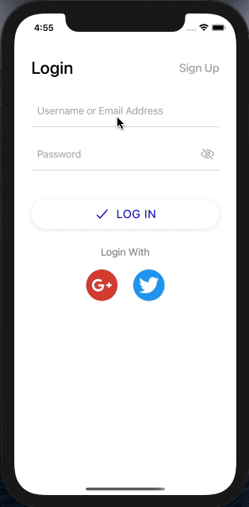
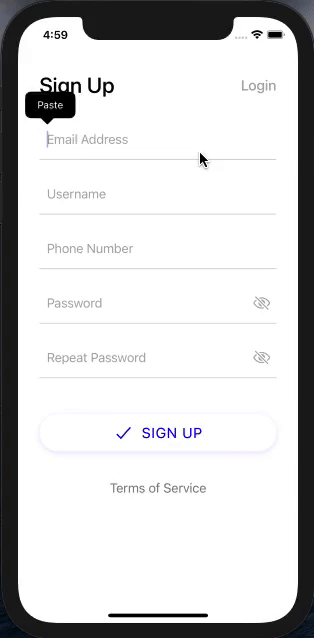
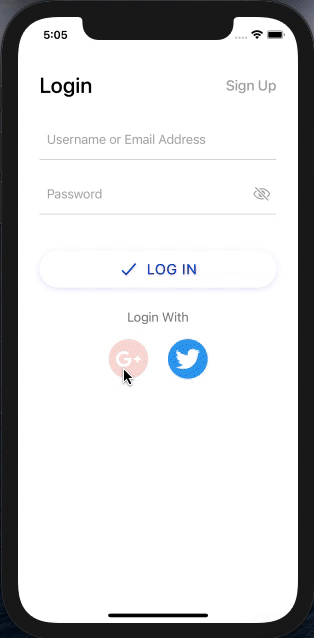
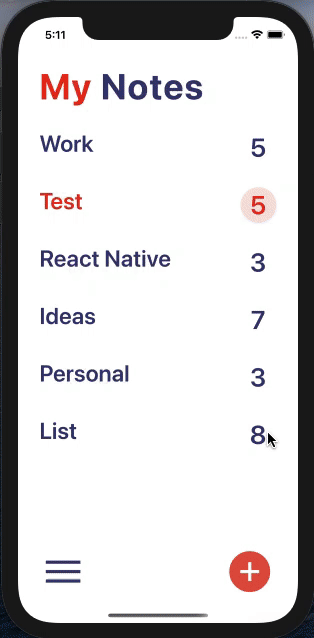
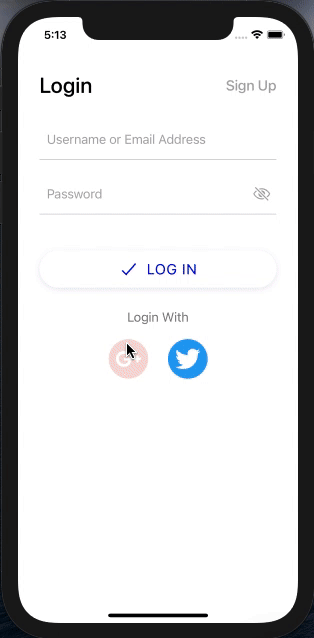

> # React-Native Todo List App
>
> ## Rules and Regulations
>
> ### 1. Minimum use of margin and padding, ignore image upload on login / signup
>
> ### 2. Dark Mode Support in Menu (Drawer)
>
> ### 3. Logout in the Drawer along with toggle for dark mode
>
> ### 4. Maintain Session
>
> ### 5. Any 1 Social Login
>
> ### 6. In case of Social Login send social Id for Login and Signup
>
> ### 7. Highlight the latest title of Notes Section in Red (Check Date)
>
> ### 8. Create a separate repo
>
> ### 9. Follow the structure and naming conventions as per instructions
>
> ### 10. Use icon8.com to get required icons
>
> ### 11. Use only local assets
>
> ### 12. Redux has to been implemented
>
> ### 13. Use Animation to display data
>
> ### 14. Create a cross icon to delete notes on top right of every notes
>
> ### 15. Test App on both Android and iOS
>
> ### 16. Validation for all fields
>
> - ### Email
> - ### Password (6 Characters, Uppercase , lowercase , special character and number)
> - ### Username (length minimum 4 and no space)

> # ScreenShots
>
> ## Login Functionality
>
> 

> ## SigUp and Validation Functionality
>
> 

> ## Notes and Animation Functionality
>
> 

> ## Session Management Functionality
>
> 

> ## Theme Functionality
>
> 
